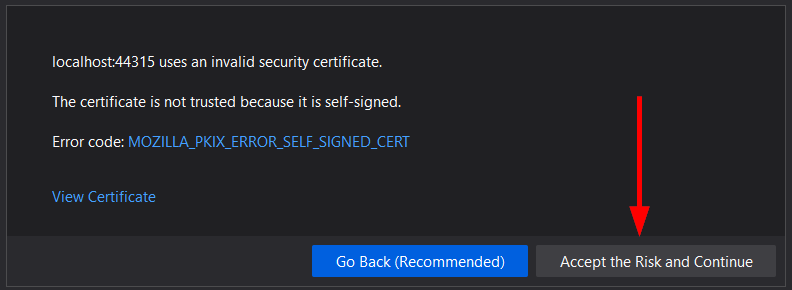

# Capstone Starter Project

## Database

Inside the `<project-root>/database/` directory, there's a SQL script called `capstone.sql` that can be used to build and rebuild a Microsoft SQL Server database for the capstone project.

The SQL script drops the database if it exists and creates a new database called `final_capstone`. You may choose to modify the script to change the database name, or add more tables and data to it.

If you change the database name, be sure to update the connection string in the server project. See the connection string section for more about this.

### Default users

The script creates two default users for your application—you may choose to use them or not. You may also choose to modify the default users and roles as you see fit.

| Username | Password   | Role    |
| -------- | ---------- | ------- |
| `user`   | `password` | `user`  |
| `admin`  | `password` | `admin` |

## ASP.NET Server

An ASP.NET Core Web API server project has been created for you to use as a starting point.

### Connection string

A connection string to the database has been configured for you in `appsettings.json`. It connects to the `final_capstone` database using your Windows login (`Trusted_Connection`).

You can change the name of this database if you want, but remember to change it here and in the `capstone.sql` script in the database folder:

```json
"ConnectionStrings": {
    "Project": "Server=.\\SQLEXPRESS;Database=final_capstone;Trusted_Connection=True;"
},
```

### CORS

The ASP.NET server has been pre-configured for you to accept Cross-Origin Resource Sharing (CORS) requests. This is necessary because your client and server both run on `localhost` but with different ports.

#### Firefox: "CORS request did not succeed"

If you use Firefox for your testing, you may encounter this message in the browser console when attempting a login or any other request from Vue to your .NET server:

```
Cross-Origin Request Blocked: The Same Origin Policy disallows reading the remote resource at https://localhost:44315/login. (Reason: CORS request did not succeed).
```

This is because the HTTPS certificate used by your .NET project is a self-signed certificate intended for development, and [Firefox doesn't consider it valid for CORS requests](https://developer.mozilla.org/en-US/docs/Web/HTTP/CORS/Errors/CORSDidNotSucceed). You'll have to tell Firefox to trust your certificate by completing these steps:

1. Open your project URL in Firefox. This should be `https://localhost:44315/`; adjust port number if necessary.
2. Firefox displays a warning message similar to the one below. Click the "Advanced" button:


3. In the "Advanced" panel that opens, click "Accept the Risk and Continue":



Your CORS requests from Vue to your .NET server now work.

### Security

Most of the functionality related to JWT generation and security is located in the `Security` folder. You shouldn't have to modify anything here, but feel free to go through the code if you'd like to see how things work.

### Login Controller

There's a single controller in the `Controllers` folder: `LoginController.cs`. This controller responds to the `/login` and `/register` endpoints and works with the Vue starter as is. If you need to modify the user registration form, start here.

The controller uses the `UserSqlDAO` to read and write data from the `users` table.
